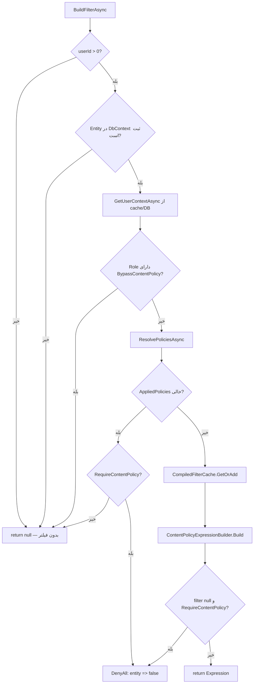
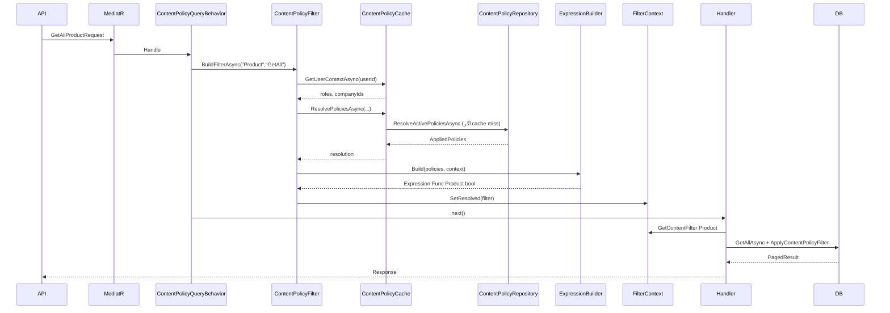
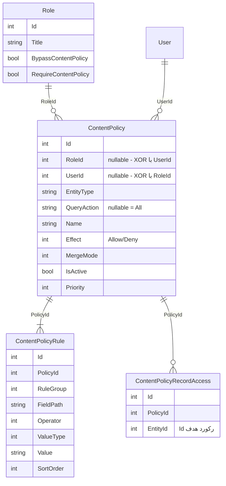

# راهنمای جامع Content Policy

این سند توضیح می‌دهد **Content Policy** در Edition چیست، چگونه کار می‌کند، و با چه ruleهایی می‌توان دسترسی به داده‌ها را در queryها (GetAll، Search، Get و …) کنترل کرد.

---

## فهرست

0. [معماری و فلو اجرایی (Runtime)](#0-معماری-و-فلو-اجرایی-runtime)
1. [Content Policy چیست؟](#1-content-policy-چیست)
2. [مفاهیم اصلی](#2-مفاهیم-اصلی)
   - [2.1 موجودیت‌ها و Enumهای دامنه](#21-موجودیت‌ها-و-enumهای-دامنه)
3. [ساختار یک Rule](#3-ساختار-یک-rule)
4. [Field Path — مسیر فیلد](#4-field-path--مسیر-فیلد)
5. [اپراتورها](#5-اپراتورها)
6. [نوع مقدار (Value Type)](#6-نوع-مقدار-value-type)
7. [Rule Group — ترکیب شرط‌ها](#7-rule-group--ترکیب-شرط‌ها)
8. [Allow و Deny](#8-allow-و-deny)
9. [Record Access — دسترسی سطح رکورد](#9-record-access--دسترسی-سطح-رکورد)
10. [Merge Mode — ترکیب policy کاربر و نقش](#10-merge-mode--ترکیب-policy-کاربر-و-نقش)
11. [Query Action — محدود کردن به یک عملیات](#11-query-action--محدود-کردن-به-یک-عملیات)
12. [تنظیمات نقش (Role)](#12-تنظیمات-نقش-role)
13. [مثال‌های عملی](#13-مثال‌های-عملی)
14. [سناریوهای پیشرفته](#14-سناریوهای-پیشرفته)
15. [Collection — semantics مهم](#15-collection--semantics-مهم)
16. [محدودیت‌ها](#16-محدودیت‌ها)
17. [Performance](#17-performance)
18. [API متادیتا و اعتبارسنجی](#18-api-متادیتا-و-اعتبارسنجی)
19. [عیب‌یابی](#19-عیب‌یابی)

---

## 0. معماری و فلو اجرایی (Runtime)

این بخش جواب سه سؤال اصلی را می‌دهد:

1. **کی** فیلتر ساخته می‌شود؟
2. **کجا** نگه‌داری و اعمال می‌شود؟
3. **چطور** از ruleهای دیتابیس به `WHERE` در SQL می‌رسد؟

> بخش‌های بعدی سند (اپراتورها، Field Path، مثال rule) درباره **چه چیزی** در policy می‌نویسید هستند. این بخش درباره **مکانیزم اجرا** است.

---

### 0.1. نمای کلی — دو مسیر جدا

سیستم دو سناریو را پوشش می‌دهد:

| سناریو | Request نمونه | Behavior مسئول | نحوه اعمال |
|--------|---------------|----------------|------------|
| **لیست / جستجو** | `GetAllProductRequest`, `SearchProductRequest` | `ContentPolicyQueryBehavior` | `Expression` روی `IQueryable` → `WHERE` در SQL |
| **خواندن تکی** | `GetProductRequest` (با `Id`) | `ContentPolicyResourceBehavior` | `EXISTS` با `Id = X AND (فیلتر policy)` |

```
                    ┌─────────────────────────────────────┐
                    │  Admin: Create/Update ContentPolicy │
                    │  + Rules + RecordAccess در DB       │
                    └─────────────────┬───────────────────┘
                                      │ InvalidateAllAsync
                                      ▼
                    ┌─────────────────────────────────────┐
                    │  Cache: UserContext + Policies      │
                    │  + CompiledFilterCache (expression) │
                    └─────────────────┬───────────────────┘
                                      │
     API Request ──► MediatR Pipeline │
                                      ▼
              ┌───────────────────────────────────────────┐
              │ 1. ContentPolicyQueryBehavior           │
              │    (فقط IContentPolicyFilteredRequest)  │
              │    → BuildFilterAsync → SetResolved       │
              ├───────────────────────────────────────────┤
              │ 2. ValidationBehavior                   │
              ├───────────────────────────────────────────┤
              │ 3. ContentPolicyResourceBehavior          │
              │    (Get/Update/Delete با Id)              │
              │    → EnsureAccessibleAsync                │
              ├───────────────────────────────────────────┤
              │ 4. Handler                              │
              │    → GetContentFilter<T>() از Context     │
              │    → Repository.ApplyContentPolicyFilter  │
              └───────────────────────────────────────────┘
```

---

### 0.2. مرحله ۱ — تعریف Policy (قبل از Runtime)

**کجا:** ادمین از APIهای `ContentPolicy`، `ContentPolicyRule`، `ContentPolicyRecordAccess` استفاده می‌کند.

**چه چیزی ذخیره می‌شود:**

```
ContentPolicy
 ├── EntityType: "Product"
 ├── QueryAction: "GetAll" | "Search" | "Get" | null (= All)
 ├── Effect: Allow | Deny
 ├── Scope: RoleId یا UserId
 ├── MergeMode: Additive | ReplaceRole  (فقط User policy)
 ├── Priority, IsActive
 ├── Rules[]  → FieldPath, Operator, Value, RuleGroup, ...
 └── RecordAccesses[]  → EntityIdهای استثنا
```

**بعد از هر تغییر** (Create/Update/Delete policy، rule، record access، user-role):

- `IContentPolicyCache.InvalidateAllAsync()` صدا زده می‌شود
- **generation** cache یکی زیاد می‌شود → کلیدهای policy قدیمی بی‌اثر می‌شوند
- `ContentPolicyCompiledFilterCache.Clear()` → expressionهای compile‌شده پاک می‌شوند

تا زمانی که policy عوض نشود، فیلتر از cache خوانده می‌شود (سریع).

---

### 0.3. مرحله ۲ — MediatR Pipeline (ورود هر Request)

**ثبت در** `ConfigureServices.cs`:

```csharp
cfg.AddBehavior(typeof(IPipelineBehavior<,>), typeof(ContentPolicyQueryBehavior<,>));
cfg.AddBehavior(typeof(IPipelineBehavior<,>), typeof(ValidationBehavior<,>));
cfg.AddBehavior(typeof(IPipelineBehavior<,>), typeof(ContentPolicyResourceBehavior<,>));
```

**ترتیب اجرا:** از بیرون به داخل — اول Query، بعد Validation، بعد Resource، در آخر Handler.

#### ContentPolicyQueryBehavior — ساخت فیلتر برای لیست

فقط وقتی فعال می‌شود که:

1. Request اینترفیس `IContentPolicyFilteredRequest` را implement کند (مثلاً `GetAllProductRequest`)
2. `IContentPolicyFilterContext.IsResolved` هنوز `false` باشد (یک بار per request)

**کارهایی که انجام می‌دهد:**

```csharp
entityTypeName = filteredRequest.EntityClrType.Name;   // مثلاً "Product"
queryActionKey   = ResolveQueryActionKey(...);       // مثلاً "GetAll"

filter = await contentPolicyFilter.BuildFilterAsync(entityTypeName, queryActionKey);

contentPolicyFilterContext.SetResolved(entityTypeName, queryActionKey, filter, denyAll);
```

**تشخیص QueryAction** (به ترتیب اولویت):

| منبع | مثال | نتیجه |
|------|------|-------|
| `CustomContentPolicyQueryAction` روی request | `"ExportReport"` | همان رشته normalize‌شده |
| `ContentPolicyQueryAction` enum روی request | `GetAll` | `"GetAll"` |
| نام کلاس request | `GetAllProductRequest` | `"GetAll"` |
| | `SearchProductRequest` | `"Search"` |
| | `GetProductRequest` | `"GetProduct"` (برای resource behavior) |

#### ContentPolicyResourceBehavior — بررسی دسترسی Get تکی

برای requestهایی که **لیست برنمی‌گردانند** و یک `Id` دارند (مثلاً `GetProductRequest`):

1. `ContentPolicyResourceRequestResolver` از نام request نوع entity را حدس می‌زند (`GetProduct` → `Product`)
2. property `Id` را می‌خواند
3. `ContentPolicyAccessChecker.EnsureAccessibleAsync` فیلتر را با `QueryAction = Get` می‌سازد
4. در DB چک می‌کند: `EXISTS Product WHERE Id = X AND (فیلتر)`
5. اگر نباشد → `AppContentPolicyAccessDeniedException`

> Requestهای `IContentPolicyFilteredRequest` از resource behavior **معاف** هستند (تا دوبار چک نشوند).

---

### 0.4. مرحله ۳ — ساخت Expression (`ContentPolicyFilter.BuildFilterAsync`)

این قلب runtime است. فلو دقیق:



#### ۳.۱. بارگذاری Context کاربر

از `ContentPolicyRepository.GetUserContentPolicyContextAsync`:

- نقش‌های کاربر + فلگ‌های `BypassContentPolicy` / `RequireContentPolicy`
- `CompanyIds` (شرکت‌هایی که `UserId` مالک آن‌هاست)

#### ۳.۲. Resolve Policyها از DB

`ResolveActivePoliciesAsync` policyهای **فعال** را می‌خواند:

```sql
WHERE IsActive = true
  AND EntityType = @entityType
  AND (QueryAction IS NULL OR QueryAction = @queryAction)
  AND (UserId = @userId  OR  RoleId IN @roleIds)
```

سپس `ContentPolicyPolicyResolver.Resolve` merge می‌کند:

```
اگر User policy با MergeMode=ReplaceRole وجود دارد:
    Applied = فقط User policies
وگرنه:
    Applied = User policies + Role policies  (Additive)
```

#### ۳.۳. ساخت Expression از Policyها

`ContentPolicyExpressionBuilder` برای هر policy:

```
داخل policy:
  RuleGroup 0: rule₁ AND rule₂ AND ...
  RuleGroup 1: rule₃ AND ...
  ...
  policyExpr = Group₀ OR Group₁ OR ... OR RecordAccess(Id=42 OR Id=58)

بین policyها:
  allowOr  = Allow₁ OR Allow₂ OR ...
  denyOr   = Deny₁  OR Deny₂  OR ...

نهایی:
  allowOr AND NOT(denyOr)     // اگر هر دو باشند
  allowOr                      // فقط Allow
  NOT(denyOr)                  // فقط Deny → همه به‌جز match‌شده‌ها
```

هر rule توسط `ContentPolicyRuleExpressionFactory` به `Expression` تبدیل می‌شود:

- `Product.IsActive = true` → `entity.IsActive == true`
- `Product.ProductDiscounts.Code Contains "X"` → `entity.ProductDiscounts.Any(d => d.Code.Contains("X"))`
- `ValueType = Context` → `ContentPolicyValueResolver` مقدار `UserId` / `CompanyIds` را inject می‌کند

**Rule نامعتبر:** log warning + skip (اگر همه ruleها invalid باشند → policy match نمی‌کند).

#### ۳.۴. Cache کلید Compile

کلید SHA256 شامل: generation، entityType، queryAction، userId، roleIds، companyIds، merge mode، id policyهای applied.

با تغییر policy یا نقش کاربر، کلید عوض می‌شود و expression دوباره ساخته می‌شود.

---

### 0.5. مرحله ۴ — ذخیره در Request Scope (`ContentPolicyFilterContext`)

`IContentPolicyFilterContext` **Scoped** است — یک instance per HTTP request.

بعد از `SetResolved`:

| Property | معنی |
|----------|------|
| `EntityTypeName` | `"Product"` |
| `QueryAction` | `"GetAll"` |
| `DenyAll` | `true` اگر expression = `entity => false` |
| `_filter` | `Expression<Func<TEntity, bool>>` |

Handler با extension می‌خواند:

```csharp
var filter = contentPolicyFilterContext.GetContentFilter<Product>();
```

اگر entity type با context مطابقت نداشته باشد → `null` (بدون فیلتر اضافه).

---

### 0.6. مرحله ۵ — اعمال روی Query (SQL)

**Handler** (مثال واقعی `GetAllProductHandler`):

```csharp
var filter = contentPolicyFilterContext.GetContentFilter<Domain.Entities.Product>();
var products = await productRepository.GetAllAsync(requestModel, filter, cancellationToken);
```

**Repository:**

```csharp
var productSource = Context.Product.ApplyContentPolicyFilter(contentFilter);
// معادل: contentFilter is null ? query : query.Where(contentFilter)
```

EF Core expression را به SQL ترجمه می‌کند:

| Expression | SQL تقریبی |
|------------|------------|
| `entity.IsActive == true` | `WHERE [IsActive] = 1` |
| `entity.ProductDiscounts.Any(...)` | `WHERE EXISTS (SELECT 1 FROM ProductDiscount ...)` |
| `entity => false` (DenyAll) | `WHERE 0 = 1` |

**نکته:** فیلتر policy **قبل از** joinها و فیلترهای business اعمال می‌شود (روی `DbSet` اصلی).

---

### 0.7. مثال End-to-End — GetAllProduct

**تنظیمات:**

- Role «فروشنده»: `RequireContentPolicy = true`
- Policy Allow روی Role:
  - `EntityType = Product`, `QueryAction = GetAll`
  - Rule: `Product.IsActive Equals true`

**فلو:**

```
1. GET /api/v1/admin/product/get-all
2. MediatR → GetAllProductRequest (IContentPolicyFilteredRequest<Product>)
3. ContentPolicyQueryBehavior:
   - entityTypeName = "Product"
   - queryActionKey = "GetAll"
   - BuildFilterAsync → Expression: p => p.IsActive == true
   - SetResolved در Context
4. GetAllProductHandler:
   - filter = context.GetContentFilter<Product>()
   - repository.GetAllAsync(..., filter)
5. SQL تقریبی:
   SELECT ... FROM Product p
   WHERE p.IsActive = 1
   AND ... (joinها و فیلتر pagination)
```

**اگر همان کاربر GetProduct با Id=99 بزند:**

```
1. GetProductRequest — IContentPolicyFilteredRequest نیست
2. ContentPolicyQueryBehavior → skip
3. ContentPolicyResourceBehavior:
   - entity = Product, id = 99
   - BuildFilterAsync با QueryAction = "Get"
   - EXISTS Product WHERE Id=99 AND IsActive=1
4. اگر false → 403 ContentPolicyAccessDenied
5. اگر true → Handler ادامه می‌دهد
```

---

### 0.8. جدول تصمیم — کی فیلتر `null` است؟

| شرط | نتیجه فیلتر | معنی برای کاربر |
|-----|-------------|-----------------|
| کاربر لاگین نیست (`userId <= 0`) | `null` | بدون محدودیت policy |
| Entity در registry نیست | `null` | بدون محدودیت |
| `BypassContentPolicy = true` | `null` | دسترسی کامل |
| Policy نیست + `RequireContentPolicy` | `entity => false` | **هیچ رکورد** |
| Policy نیست + بدون Require | `null` | دسترسی کامل |
| Policy هست | Expression | فقط رکوردهای match |
| Expression ساخت نشد + Require | `entity => false` | **هیچ رکورد** |

---

### 0.9. دیاگرام Sequence — GetAll



---

### 0.10. نقشه فایل‌ها در Runtime

| مرحله | فایل | مسئولیت |
|-------|------|---------|
| Pipeline ورود | `Common/Behaviors/ContentPolicyQueryBehavior.cs` | تشخیص request + فراخوانی Build |
| Pipeline Get تکی | `Common/Behaviors/ContentPolicyResourceBehavior.cs` | چک دسترسی قبل از handler |
| ساخت فیلتر | `Services/ContentPolicies/ContentPolicyFilter.cs` | orchestration + cache + deny logic |
| Resolve policy | `Repositories/ContentPolicyRepository.cs` | خواندن از DB |
| Merge user/role | `Domain/ContentPolicies/ContentPolicyPolicyResolver.cs` | Additive vs ReplaceRole |
| ساخت expression | `ContentPolicyExpressionBuilder.cs` | Allow/Deny OR + RuleGroup AND |
| هر rule | `ContentPolicyRuleExpressionFactory.cs` | path → LINQ tree |
| مقادیر Context | `ContentPolicyValueResolver.cs` | UserId, CompanyIds, ... |
| نگه‌داری per-request | `ContentPolicyFilterContext.cs` | SetResolved / GetFilter |
| خواندن در handler | `Common/Extensions/ContentPolicyHandlerExtensions.cs` | `GetContentFilter<T>()` |
| اعمال SQL | `Extensions/ContentPolicyQueryableExtensions.cs` | `.Where(filter)` |
| چک Get تکی | `ContentPolicyAccessChecker.cs` + `ContentPolicyEntityAccessQuery.cs` | EXISTS با Id |
| Cache | `ContentPolicyCache.cs` + `ContentPolicyCompiledFilterCache` | user context + compiled expr |
| Opt-in لیست | `Contracts/.../IContentPolicyFilteredRequest.cs` | marker روی request |
| تشخیص Get | `ContentPolicyResourceRequestResolver.cs` | نام request → entity + Id |

---

### 0.11. چک‌لیست برای اضافه کردن Entity جدید

1. Entity در `EditionDbContext` به‌صورت `DbSet<T>` ثبت باشد
2. Request لیست/جستجو: `IContentPolicyFilteredRequest<TEntity>` implement کند
3. Handler: `contentPolicyFilterContext.GetContentFilter<TEntity>()` بگیرد
4. Repository: پارامتر `Expression<Func<TEntity, bool>>? contentFilter` + `ApplyContentPolicyFilter`
5. (اختیاری) Request Get تکی: نام `Get{Entity}Request` با property `Id` — resource behavior خودکار کار می‌کند
6. در ادمین policy با `EntityType` صحیح تعریف شود

---

## 1. Content Policy چیست؟

Content Policy یک **موتور فیلتر declarative** است که روی queryهای خواندن داده اعمال می‌شود. به‌جای hardcode کردن شرط دسترسی در هر handler، policy را در دیتابیس تعریف می‌کنید و سیستم به‌صورت خودکار expression فیلتر می‌سازد و روی `IQueryable` اعمال می‌کند.

```
کاربر درخواست GetAllProduct می‌دهد
        ↓
ContentPolicyQueryBehavior فیلتر را می‌سازد
        ↓
ProductRepository: query.ApplyContentPolicyFilter(filter)
        ↓
SQL با WHERE / EXISTS / COUNT تولید می‌شود
        ↓
فقط رکوردهای مجاز برگردانده می‌شوند
```

**Entityهای پشتیبانی‌شده:** هر entityای که در `EditionDbContext` به‌صورت `DbSet<T>` ثبت شده و `IEntity<int>` باشد (مثل `Product`، `Bank`، `Order`، …). خود entityهای `ContentPolicy` و `ContentPolicyRule` از policy مستثنی هستند.

---

## 2. مفاهیم اصلی

| مفهوم | توضیح |
|--------|--------|
| **Policy** | یک سیاست دسترسی برای یک entity و (اختیاری) یک QueryAction |
| **Rule** | یک شرط روی یک فیلد (`FieldPath` + `Operator` + `Value`) |
| **Effect** | `Allow` (مجاز) یا `Deny` (ممنوع) |
| **Priority** | اولویت عددی — policy با priority کمتر زودتر در ترکیب نهایی لحاظ می‌شود |
| **Scope** | policy روی **Role** یا **User** تعریف می‌شود |
| **QueryAction** | policy فقط برای عملیات خاص (مثلاً `GetAll`) یا برای همه (`All`) |
| **Record Access** | لیست Idهای مشخص که policy روی آن‌ها اعمال می‌شود |

---

## 2.1 موجودیت‌ها و Enumهای دامنه

این بخش هر **جدول/entity** و **enum** مرتبط با Content Policy را با جزئیات propertyها توضیح می‌دهد.

### نمای ارتباطی (ER)



**قانون مهم Scope:** هر `ContentPolicy` دقیقاً به **یک** نقش **یا** یک کاربر تعلق دارد — نه هر دو. این در DB با check constraint `CK_ContentPolicy_Scope` enforce شده:

```
(RoleId IS NOT NULL AND UserId IS NULL)  OR  (RoleId IS NULL AND UserId IS NOT NULL)
```

---

### ContentPolicy

**مسیر:** `src/Core/Edition.Domain/Entities/ContentPolicy.cs`  
**جدول:** `ContentPolicy`  
**Attribute:** `[ExcludeFromContentPolicy]` — خود این entity از فیلتر policy مستثنی است.

ریشهٔ مدل است: یک سیاست دسترسی برای یک نوع entity (مثلاً `Product`) که شامل ruleها و record accessها می‌شود.

| Property | نوع | اجباری | توضیح |
|----------|-----|--------|--------|
| `Id` | `int` | بله | کلید اصلی (از `BaseEntity`) |
| `RoleId` | `int?` | یکی از Role/User | policy متعلق به **نقش**. اگر پر باشد `UserId` باید null باشد |
| `UserId` | `int?` | یکی از Role/User | policy متعلق به **کاربر خاص**. اگر پر باشد `RoleId` باید null باشد |
| `EntityType` | `ContentPolicyEntityType` | بله | enum متمرکز — نام member با CLR type یکی است (مثلاً `Product = 5`). لیست کامل از API `entity-types` |
| `QueryAction` | `ContentPolicyQueryAction` | بله | enum — `All = 0` (wildcard)، `Get = 1`، `GetAll = 2`، `Search = 3`، `GetUserAddresses = 4`. پیش‌فرض: `All` |
| `Name` | `string` | بله | عنوان نمایشی policy برای ادمین. max 100 |
| `Effect` | `ContentPolicyEffect` | بله | `Allow` (1) یا `Deny` (2). پیش‌فرض: Allow |
| `MergeMode` | `ContentPolicyMergeMode` | بله | نحوه ترکیب با policy نقش — **فقط برای User policy** معنا دارد. برای Role policy همیشه Additive در نظر گرفته می‌شود. پیش‌فرض: Additive |
| `IsActive` | `bool` | بله | policy غیرفعال در runtime خوانده نمی‌شود. پیش‌فرض: `true` |
| `Priority` | `int` | بله | اولویت در ترکیب — عدد **کمتر** = اولویت **بالاتر** در مرتب‌سازی. همراه با `Id` برای ترتیب پایدار |
| `Scope` | `ContentPolicyScope` | محاسباتی | property محاسباتی: اگر `UserId` داشته باشد → `User`، وگرنه → `Role` |
| `Role` | `Role?` | navigation | FK به `Role` — `OnDelete: Restrict` |
| `User` | `User?` | navigation | FK به `User` — `OnDelete: Restrict` |
| `Rules` | `ICollection<ContentPolicyRule>` | navigation | شرط‌های declarative policy. حذف policy → cascade delete ruleها |
| `RecordAccesses` | `ICollection<ContentPolicyRecordAccess>` | navigation | Idهای رکورد استثنا/مشخص. cascade delete |

**Indexها (برای performance resolve):**
- `(RoleId, EntityType, QueryAction, IsActive)`
- `(UserId, EntityType, QueryAction, IsActive)`

**متدهای دامنه مهم:**
- `Create(...)` — ساخت policy جدید با enumهای `EntityType` و `QueryAction`
- `Update(...)` — به‌روزرسانی Name, Effect, IsActive, Priority, QueryAction
- `UpdateScope(...)` — تغییر RoleId/UserId/MergeMode
- `AddRules` / `ReplaceRules` — مدیریت ruleها در حافظه قبل از persist

**نحوه ذخیره در DB:** هر دو `EntityType` و `QueryAction` به‌صورت **int** (enum) ذخیره می‌شوند.

| `ContentPolicyQueryAction` | int | match با request |
|----------------------------|-----|------------------|
| `All` | 0 | همه عملیات |
| `Get` | 1 | GetProduct، GetOrder، … |
| `GetAll` | 2 | GetAllProduct، … |
| `Search` | 3 | SearchCategory، … |
| `GetUserAddresses` | 4 | GetUserAddresses |

در runtime: policy با `QueryAction = All` روی **همه** عملیات match می‌شود (`Matches`).

**API فرانت:** لیست enumها از `POST /content-policy-metadata/entity-types` و `rule-options` (شامل `QueryActions` و `RuleGroups`).

---

### ContentPolicyRule

**مسیر:** `src/Core/Edition.Domain/Entities/ContentPolicyRule.cs`  
**جدول:** `ContentPolicyRule`  
**Attribute:** `[ExcludeFromContentPolicy]`

یک **شرط تکی** روی یک فیلد از entity هدف. چند rule با `RuleGroup` و `SortOrder` ترکیب می‌شوند.

| Property | نوع | اجباری | توضیح |
|----------|-----|--------|--------|
| `Id` | `int` | بله | کلید اصلی |
| `PolicyId` | `int` | بله | FK به `ContentPolicy` — index شده |
| `RuleGroup` | `ContentPolicyRuleGroup` | بله | enum گروه منطقی: `Group0` تا `Group9`. ruleهای **یک گروه** با **AND**؛ **گروه‌ها** با **OR** |
| `FieldPath` | `string` | بله | مسیر فیلد از root entity، مثلاً `Product.IsActive`، `Product.ProductDiscounts.Code`. max 150. باید با prefix entity شروع شود |
| `Operator` | `ContentPolicyOperator` | بله | نوع مقایسه (Equals, In, Between, Exists, Count*, …) — ذخیره به‌صورت int |
| `ValueType` | `ContentPolicyValueType` | بله | `Literal` (1) = مقدار ثابت در `Value`؛ `Context` (2) = مقدار از کاربر جاری (`UserId`, `CompanyIds`, …) |
| `Value` | `string` | بله | مقدار rule به‌صورت رشته. فرمت بسته به operator: `"5"`، `"1,2,3"` برای In، `"10,20"` برای Between، `"CompanyIds"` برای Context. max 200 |
| `SortOrder` | `int` | بله | ترتیب ارزیابی ruleها **داخل یک RuleGroup** (صعودی) |
| `Policy` | `ContentPolicy` | navigation | policy والد |

**متدهای دامنه:**
- `Create(...)` — rule بدون PolicyId (هنگام ساخت policy جدید)
- `CreateForPolicy(policyId, ...)` — rule برای policy موجود
- `Update(...)` — به‌روزرسانی همه فیلدهای rule

**نکته runtime:** rule نامعتبر (FieldPath اشتباه، operator ناسازگار) در زمان build expression **skip** می‌شود و warning در log ثبت می‌شود.

---

### ContentPolicyRecordAccess

**مسیر:** `src/Core/Edition.Domain/Entities/ContentPolicyRecordAccess.cs`  
**جدول:** `ContentPolicyRecordAccess`  
**Attribute:** `[ExcludeFromContentPolicy]`

دسترسی **سطح رکورد** — بدون rule، مستقیماً Id رکوردهای مشخص را به policy وصل می‌کند.

| Property | نوع | اجباری | توضیح |
|----------|-----|--------|--------|
| `Id` | `int` | بله | کلید اصلی |
| `PolicyId` | `int` | بله | FK به `ContentPolicy` — index شده |
| `EntityId` | `int` | بله | `Id` رکورد در entity هدف (مثلاً `Product.Id = 42`) |
| `Policy` | `ContentPolicy` | navigation | policy والد |

**Unique index:** `(PolicyId, EntityId)` — هر Id فقط یک‌بار per policy.

**Semantics در expression:** با rule groupها **OR** می‌شود:

```
(RuleGroup₀ OR RuleGroup₁ OR ...) OR (Id = 42 OR Id = 58 OR ...)
```

**کاربرد:** استثنا (محصول 42 همیشه دیده شود)، یا policy فقط با record access بدون rule (لیست سفید Idها).

---

### Role — فلگ‌های مرتبط با Content Policy

**مسیر:** `src/Core/Edition.Domain/Entities/Role.cs`

Content Policy مستقیماً FK به Role ندارد (از طریق `ContentPolicy.RoleId`)، ولی دو فلگ روی **نقش** رفتار runtime را کنترل می‌کنند:

| Property | نوع | پیش‌فرض | توضیح |
|----------|-----|---------|--------|
| `BypassContentPolicy` | `bool` | `false` | اگر **هر** نقش کاربر این فلگ را داشته باشد → **هیچ فیلتری** اعمال نمی‌شود (دسترسی کامل). معمولاً admin |
| `RequireContentPolicy` | `bool` | `false` | اگر **هر** نقش کاربر این فلگ را داشته باشد و policy applicable نباشد → **Deny All** (هیچ رکورد). کاربر باید حتماً policy داشته باشد |

**متدها:** `SetBypassContentPolicy(bool)`، `SetRequireContentPolicy(bool)`

**ترکیب نقش‌ها:** اگر کاربر چند نقش دارد، `Bypass` یا `Require` با **OR** لحاظ می‌شود — یک نقش Bypass کافی است برای رد شدن کامل فیلتر.

---

### ExcludeFromContentPolicyAttribute

**مسیر:** `src/Core/Edition.Domain/ContentPolicies/ExcludeFromContentPolicyAttribute.cs`

```csharp
[AttributeUsage(AttributeTargets.Class)]
public sealed class ExcludeFromContentPolicyAttribute : Attribute;
```

روی کلاس entity می‌زنید تا در **registry** entityهای قابل فیلتر نیاید. فعلاً روی:
- `ContentPolicy`
- `ContentPolicyRule`
- `ContentPolicyRecordAccess`

این entityها نمی‌توانند target policy باشند (جلوگیری از recursive policy روی خود policy).

---

### Enumها

#### ContentPolicyEffect

| مقدار | عدد | توضیح |
|-------|-----|--------|
| `Allow` | 1 | رکوردهایی که match شوند **مجاز** — در expression با OR بین Allow policyها |
| `Deny` | 2 | رکوردهایی که match شوند **ممنوع** — در expression: `AND NOT (Deny₁ OR Deny₂)` |

#### ContentPolicyMergeMode

| مقدار | عدد | توضیح |
|-------|-----|--------|
| `Additive` | 0 | policy کاربر **با** policy نقش merge می‌شود (پیش‌فرض) |
| `ReplaceRole` | 1 | اگر **هر** user policy این mode را داشته باشد → policyهای نقش **نادیده** گرفته می‌شوند |

> روی Role policy ذخیره می‌شود ولی در `NormalizeMergeMode` برای role همیشه Additive force می‌شود.

#### ContentPolicyScope

| مقدار | عدد | توضیح |
|-------|-----|--------|
| `Role` | 1 | policy متعلق به نقش (`RoleId` پر است) |
| `User` | 2 | policy متعلق به کاربر (`UserId` پر است) |

property محاسباتی روی `ContentPolicy.Scope` — در DB ستون جدا ندارد.

#### ContentPolicyEntityType

enum متمرکز برای entity هدف — **نام member = نام CLR type**. مقادیر 1–73 پایدار در DB.

نمونه: `Product = 5`، `Wallet = 71`، `Order = 2`. لیست کامل در `src/Core/Edition.Domain/Enums/ContentPolicyEntityType.cs`.

#### ContentPolicyRuleGroup

| مقدار | int | توضیح |
|-------|-----|--------|
| `Group0` | 0 | گروه OR اول (پیش‌فرض) |
| `Group1` … `Group9` | 1–9 | گروه‌های OR بعدی |

#### ContentPolicyQueryAction

| مقدار | عدد | Storage Key در DB | توضیح |
|-------|-----|-------------------|--------|
| `All` | 0 | `0` | wildcard — همه عملیات |
| `Get` | 1 | `1` | خواندن/ویرایش/حذف تکی (resource pipeline) |
| `GetAll` | 2 | `2` | لیست |
| `Search` | 3 | `3` | جستجو |
| `GetUserAddresses` | 4 | `4` | لیست آدرس‌های کاربر |

برای عملیات جدید: مقدار جدید به enum اضافه کنید — دیگر رشتهٔ دستی پشتیبانی نمی‌شود.

#### ContentPolicyOperator

اپراتورهای مقایسه در rule — همه به‌صورت int در DB:

| گروه | مقادیر |
|------|--------|
| مقایسه پایه | `Equals`(1), `NotEquals`(2), `GreaterThan`(11), `GreaterThanOrEqual`(12), `LessThan`(13), `LessThanOrEqual`(14) |
| لیست | `In`(3), `NotIn`(4) |
| وجود | `Exists`(5), `NotExists`(6) |
| رشته | `Contains`(7), `NotContains`(8), `StartsWith`(9), `EndsWith`(10) |
| Null | `IsNull`(15), `IsNotNull`(16) |
| بازه | `Between`(17), `NotBetween`(18) |
| Count (collection) | `CountEquals`(19), `CountNotEquals`(20), `CountGreaterThan`(21), `CountGreaterThanOrEqual`(22), `CountLessThan`(23), `CountLessThanOrEqual`(24) |

#### ContentPolicyValueType

| مقدار | عدد | توضیح |
|-------|-----|--------|
| `Literal` | 1 | مقدار ثابت در فیلد `Value` |
| `Context` | 2 | مقدار runtime از context کاربر: `UserId`، `RoleIds`، `CompanyIds` |

#### ContentPolicyAccessMode

**enum runtime** — در DB ذخیره نمی‌شود؛ خروجی `ContentPolicyFilter.ResolveAccessMode` برای preview/diagnostics:

| مقدار | توضیح |
|-------|--------|
| `Unrestricted` (0) | بدون فیلتر — bypass یا بدون require |
| `DenyAll` (1) | فیلتر `entity => false` |
| `Filtered` (2) | expression Allow/Deny اعمال شده |

#### ContentPolicyPropertyKind

**enum متادیتا** — برای API `GetEntitySchema` / UI ساخت rule:

| مقدار | توضیح |
|-------|--------|
| `Scalar` (1) | فیلد ساده (int, string, bool, …) |
| `Navigation` (2) | رابطه one-to-one / many-to-one |
| `Collection` (3) | رابطه one-to-many (`ICollection<T>`) |

---

### DTOهای runtime (غیر persistence)

این‌ها entity نیستند ولی در resolve و build expression استفاده می‌شوند:

| DTO | فیلدها | کاربرد |
|-----|--------|--------|
| `ContentPolicyRuleDto` | FieldPath, Operator, ValueType, Value, SortOrder, RuleGroup | نمایش rule در memory |
| `ContentPolicyWithRulesDto` | Id, RoleId, UserId, MergeMode, EntityType, QueryAction, Name, Effect, Priority, Rules[], RecordEntityIds[] | policy کامل برای expression builder |
| `ContentPolicyResolutionResult` | EffectiveMergeMode, AppliedPolicies[], ExcludedRolePolicies[] | خروجی merge user/role |
| `UserRolePolicyDto` | Id, Title, BypassContentPolicy, RequireContentPolicy | نقش‌های کاربر |
| `UserContentPolicyContextData` | Roles[], CompanyIds[] | context کاربر برای resolve |
| `ContentPolicyEntityPreviewData` | TotalEntityCount, AccessibleEntityCount, SampleAccessibleIds[] | خروجی Preview API |

---

### BaseEntity — فیلدهای مشترک

هر سه entity از `BaseEntity` ارث می‌برند:

| Property | توضیح |
|----------|--------|
| `Id` | `int` — کلید اصلی identity |

(سایر audit fieldها اگر در پروژه روی BaseEntity دیگر تعریف شده باشند — در این سه entity فقط `Id` visible است.)

---

### خلاصه: چه چیزی کجا ذخیره می‌شود

```
ContentPolicy          → «کی، روی چه entity، برای چه عملیاتی، Allow یا Deny»
ContentPolicyRule      → «شرط روی فیلد»
ContentPolicyRecordAccess → «Id رکورد مشخص»
Role.BypassContentPolicy   → «کل سیستم policy را دور بزن»
Role.RequireContentPolicy  → «بدون policy = هیچ دسترسی»
```

---

## 3. ساختار یک Rule

هر rule این فیلدها را دارد:

| فیلد | توضیح | مثال |
|------|--------|------|
| `FieldPath` | مسیر فیلد از root entity | `Product.SubCategoryId` |
| `Operator` | نوع مقایسه | `Equals`، `Between`، `CountGreaterThan` |
| `ValueType` | منبع مقدار | `Literal` یا `Context` |
| `Value` | مقدار یا مسیر context | `5` یا `UserId` |
| `RuleGroup` | شماره گروه (AND داخل گروه) | `0` |
| `SortOrder` | ترتیب اجرا داخل گروه | `0` |

**نمونه rule به‌صورت JSON (برای درک):**

```json
{
  "FieldPath": "Product.ProductDiscounts.IsActive",
  "Operator": "Equals",
  "ValueType": "Literal",
  "Value": "true",
  "RuleGroup": 0,
  "SortOrder": 0
}
```

---

## 4. Field Path — مسیر فیلد

Field Path همیشه با **نام entity** شروع می‌شود:

```
{EntityName}.{Property}[.{Property}...]
```

### 4.1. فیلد ساده (Scalar)

مستقیم روی property خود entity:

```
Product.IsActive
Product.SubCategoryId
Product.Title
Product.CreatedOnUtc
```

### 4.2. Navigation (رابطه یک-به-one)

از entity اصلی به entity مرتبط می‌روید:

```
Product.SubCategory
Product.SubCategory.CategoryId
Product.SubCategory.Category.Title
```

برای navigation می‌توانید از `Exists` / `NotExists` استفاده کنید (معادل «null نیست» / «null است»).

### 4.3. Collection (رابطه یک-به-many)

روی مجموعه‌ای مثل `ICollection<Discount>`:

```
Product.ProductDiscounts
Product.ProductDiscounts.Id
Product.ProductDiscounts.Code
Product.ProductDiscounts.Percentage
Product.OrderItems.ProductId
```

**Collection تو در تو** هم پشتیبانی می‌شود:

```
Product.OrderItems.OrderItemAttachments.FileName
```

→ معادل SQL: `EXISTS (OrderItem WHERE EXISTS (Attachment WHERE ...))`

### 4.4. عمق مسیر

حداکثر **12 segment** پس از نام entity. مسیر باید روی **public property**های واقعی entity باشد.

---

## 5. اپراتورها

### 5.1. مقایسه پایه

| اپراتور | کاربرد | Value نمونه |
|---------|--------|-------------|
| `Equals` | برابر | `5`، `true`، `"کتاب"` |
| `NotEquals` | نابرابر | `3` |
| `GreaterThan` | بزرگ‌تر | `100` |
| `GreaterThanOrEqual` | بزرگ‌تر یا مساوی | `18` |
| `LessThan` | کوچک‌تر | `50` |
| `LessThanOrEqual` | کوچک‌تر یا مساوی | `10` |

### 5.2. بازه (Between)

| اپراتور | کاربرد | Value |
|---------|--------|-------|
| `Between` | بین min و max (**شامل** هر دو) | `2,5` یا `2024-01-01,2024-12-31` |
| `NotBetween` | خارج از بازه | `10,20` |

**فرمت Value برای Between:**
- **Literal:** دو مقدار با کاما → `min,max`
- **Context:** دو مسیر با pipe → `UserId|CompanyIds` (هر بخش جدا resolve می‌شود)

### 5.3. لیست (In)

| اپراتور | کاربرد | Value |
|---------|--------|-------|
| `In` | مقدار در لیست باشد | `1,2,5,9` |
| `NotIn` | مقدار در لیست نباشد | `4,8` |

### 5.4. رشته (String)

| اپراتور | کاربرد | Value |
|---------|--------|-------|
| `Contains` | شامل زیررشته | `SUMMER` |
| `NotContains` | شامل نباشد | `test` |
| `StartsWith` | شروع شود با | `PRD-` |
| `EndsWith` | پایان یابد با | `.jpg` |

### 5.5. Null

| اپراتور | کاربرد |
|---------|--------|
| `IsNull` | مقدار null |
| `IsNotNull` | مقدار null نباشد |

### 5.6. وجود (Exists)

| اپراتور | روی چه چیزی | معنی |
|---------|-------------|------|
| `Exists` | Collection | حداقل یک آیتم دارد |
| `NotExists` | Collection | هیچ آیتمی ندارد |
| `Exists` | Navigation | رابطه مقداردهی شده (≠ null) |
| `NotExists` | Navigation | رابطه null است |
| `Exists` | bool | مقدار true |
| `NotExists` | bool | مقدار false |

### 5.7. Count (فقط روی Collection)

وقتی Field Path **روی خود collection** تمام می‌شود (بدون رفتن به property فرزند):

| اپراتور | معنی | Value |
|---------|------|-------|
| `CountEquals` | تعداد دقیقاً N | `0`، `3` |
| `CountNotEquals` | تعداد ≠ N | `1` |
| `CountGreaterThan` | تعداد > N | `2` |
| `CountGreaterThanOrEqual` | تعداد ≥ N | `1` |
| `CountLessThan` | تعداد < N | `5` |
| `CountLessThanOrEqual` | تعداد ≤ N | `1` |

**نکته:** `CountEquals` با `0` معادل `NotExists` است. `CountGreaterThan` با `0` معادل `Exists` است.

### 5.8. اپراتورهای مجاز بر اساس نوع فیلد

| نوع فیلد | اپراتورهای typical |
|----------|---------------------|
| int, long, enum | Equals, NotEquals, In, NotIn, Between, NotBetween, >, >=, <, <= |
| decimal, DateTime | Equals, NotEquals, Between, NotBetween, >, >=, <, <= |
| string | Equals, Contains, StartsWith, EndsWith, IsNull, … |
| bool | Equals, NotEquals, Exists, NotExists |
| Collection | Exists, NotExists, Count* |
| Navigation | Exists, NotExists, IsNull, IsNotNull |

> UI متادیتا (`GetEntitySchema` / `GetPropertyOperators`) اپراتورهای مجاز هر path را برمی‌گرداند.

---

## 6. نوع مقدار (Value Type)

### 6.1. Literal

مقدار ثابت در rule:

```
ValueType: Literal
Value: "true"
Value: "5"
Value: "1,2,3"
Value: "10,50"        ← برای Between
Value: "2024-06-01,2024-12-31"
```

**انواع پشتیبانی‌شده:** string, int, long, bool, decimal, double, float, Guid, DateTime, DateTimeOffset, enum

### 6.2. Context

مقدار از **کاربر جاری** خوانده می‌شود:

| مسیر Context | نوع | توضیح |
|--------------|-----|--------|
| `UserId` | int | شناسه کاربر لاگین‌شده |
| `RoleIds` | لیست int | نقش‌های کاربر |
| `CompanyIds` | لیست int | شرکت‌های مرتبط با کاربر |

**مثال — فقط محصولات SubCategory متعلق به companyهای کاربر:**

```
FieldPath:  Product.SubCategoryId
Operator:   In
ValueType:  Context
Value:      CompanyIds
```

**Between با Context:**

```
ValueType: Context
Value:       UserId|CompanyIds
```

(دو مسیر با `|` جدا می‌شوند)

---

## 7. Rule Group — ترکیب شرط‌ها

```
داخل یک RuleGroup  →  AND  (همه باید برقرار باشند)
بین RuleGroupها    →  OR   (حداقل یک گروه کافی است)
```

**مثال — محصول فعال AND در SubCategory خاص:**

| RuleGroup | FieldPath | Operator | Value |
|-----------|-----------|----------|-------|
| 0 | Product.IsActive | Equals | true |
| 0 | Product.SubCategoryId | Equals | 7 |

→ `(IsActive = true) AND (SubCategoryId = 7)`

**مثال — SubCategory 7 OR SubCategory 12:**

| RuleGroup | FieldPath | Operator | Value |
|-----------|-----------|----------|-------|
| 0 | Product.SubCategoryId | Equals | 7 |
| 1 | Product.SubCategoryId | Equals | 12 |

→ `(SubCategoryId = 7) OR (SubCategoryId = 12)`

---

## 8. Allow و Deny

### Allow Policy

رکوردی **نمایش داده می‌شود** اگر **حداقل یک** Allow policy آن را پوشش دهد.

```
Allow₁ OR Allow₂ OR Allow₃ ...
```

### Deny Policy

رکوردی **حذف می‌شود** اگر **حداقل یک** Deny policy آن را match کند.

### فرمول نهایی

```
نتیجه = (Allow₁ OR Allow₂ OR ...)  AND  NOT (Deny₁ OR Deny₂ OR ...)
```

**مثال:**

- Allow: `Product.IsActive = true`
- Deny: `Product.SubCategoryId = 99`

→ محصولات فعال **به‌جز** آن‌هایی که SubCategoryId=99 دارند.

### اولویت (Priority)

Policyها بر اساس `Priority` (صعودی) و سپس `Id` مرتب می‌شوند. در ترکیب OR/AND نهایی، همه policyهای applicable با هم ترکیب می‌شوند؛ priority بیشتر برای **ترتیب ارزیابی در OR** است، نه override خودکار.

---

## 9. Record Access — دسترسی سطح رکورد

علاوه بر rule، می‌توانید **Id رکوردهای مشخص** را به policy اضافه کنید (`ContentPolicyRecordAccess`).

```
Policy: Allow
RecordEntityIds: [42, 58, 101]
```

→ رکوردهای 42، 58، 101 **همیشه** در این policy match می‌شوند (با OR نسبت به rule groupها).

**ترکیب داخل یک policy:**

```
(RuleGroup₀ OR RuleGroup₁ OR ...)  OR  (Id = 42 OR Id = 58)
```

**مثال کاربردی:** کاربر فقط محصولات فعال را می‌بیند، **به‌علاوه** محصول 42 که استثناست.

---

## 10. Merge Mode — ترکیب policy کاربر و نقش

فقط برای **User Policy** معنا دارد:

| MergeMode | رفتار |
|-----------|--------|
| `Additive` | policy کاربر **با** policy نقش merge می‌شود |
| `ReplaceRole` | اگر **هر** user policy این mode را داشته باشد، policyهای نقش **نادیده** گرفته می‌شوند |

```
Additive:     Applied = UserPolicies + RolePolicies
ReplaceRole:  Applied = UserPolicies فقط
```

---

## 11. Query Action — محدود کردن به یک عملیات

| QueryAction | معنی |
|-------------|------|
| `All` | روی همه عملیات (GetAll، Search، Get، …) |
| `GetAll` | فقط لیست |
| `Search` | فقط جستجو |
| `Get` | فقط خواندن تکی |
| Custom string | عملیات سفارشی (مثلاً گزارش) |

**مثال:** policy فقط روی `GetAllProduct` اعمال شود، ولی `GetProduct` بدون محدودیت باشد → QueryAction = `GetAll`.

---

## 12. تنظیمات نقش (Role)

| فلگ Role | اثر |
|----------|-----|
| `BypassContentPolicy` | هیچ فیلتری اعمال نمی‌شود — دسترسی کامل |
| `RequireContentPolicy` | اگر policyای نباشد → **هیچ** رکوردی (Deny All) |

```
BypassContentPolicy = true   →  admin / super user
RequireContentPolicy = true  →  کاربر باید حتماً policy داشته باشد
```

---

## 13. مثال‌های عملی

### 13.1. فقط محصولات فعال

```
EntityType: Product
Effect:     Allow
Rule:
  FieldPath: Product.IsActive
  Operator:  Equals
  Value:     true
```

### 13.2. محصولات یک SubCategory

```
FieldPath: Product.SubCategoryId
Operator:  In
Value:     3,7,12
```

### 13.3. محصولاتی که تخفیف دارند

```
FieldPath: Product.ProductDiscounts
Operator:  Exists
Value:     (خالی)
```

### 13.4. محصولات بدون تخفیف

```
FieldPath: Product.ProductDiscounts
Operator:  NotExists
Value:     (خالی)
```

### 13.5. محصولاتی که تخفیف فعال دارند

```
FieldPath: Product.ProductDiscounts.IsActive
Operator:  Equals
Value:     true
```

### 13.6. محصولاتی که تخفیف با Id=5 دارند

```
FieldPath: Product.ProductDiscounts.Id
Operator:  Equals
Value:     5
```

### 13.7. محصولاتی که تخفیف SUMMER دارند

```
FieldPath: Product.ProductDiscounts.Code
Operator:  Contains
Value:     SUMMER
```

### 13.8. محصولات با بیش از 2 تخفیف

```
FieldPath: Product.ProductDiscounts
Operator:  CountGreaterThan
Value:     2
```

### 13.9. محصولات با حداکثر 1 تخفیف

```
FieldPath: Product.ProductDiscounts
Operator:  CountLessThanOrEqual
Value:     1
```

### 13.10. SubCategoryId بین 10 و 20

```
FieldPath: Product.SubCategoryId
Operator:  Between
Value:     10,20
```

### 13.11. تخفیف با Percentage بین 10 تا 30

```
FieldPath: Product.ProductDiscounts.Percentage
Operator:  Between
Value:     10,30
```

### 13.12. محصولاتی که SubCategory دارند

```
FieldPath: Product.SubCategory
Operator:  Exists
Value:     (خالی)
```

### 13.13. Deny — مخفی کردن SubCategory خاص

```
Effect:    Deny
FieldPath: Product.SubCategoryId
Operator:  Equals
Value:     99
```

### 13.14. Record Access — فقط چند محصول مشخص

```
Effect:           Allow
Rules:            (خالی)
RecordEntityIds:  [101, 205, 308]
```

---

## 14. سناریوهای پیشرفته

### 14.1. فعال AND (تخفیف فعال OR تخفیف SUMMER)

| RuleGroup | FieldPath | Operator | Value |
|-----------|-----------|----------|-------|
| 0 | Product.IsActive | Equals | true |
| 1 | Product.ProductDiscounts.IsActive | Equals | true |
| 2 | Product.ProductDiscounts.Code | Contains | SUMMER |

→ `IsActive AND (HasActiveDiscount OR HasSummerDiscount)`

### 14.2. Allow فعال‌ها، Deny یک SubCategory

**Policy 1 — Allow:**
```
Product.IsActive = true
```

**Policy 2 — Deny (Priority بالاتر یا جدا):**
```
Product.SubCategoryId = 99  (Deny)
```

### 14.3. فیلتر با Context — company کاربر

```
FieldPath:  CompanyProduct.CompanyId
Operator:   In
ValueType:  Context
Value:      CompanyIds
```

(روی entity `CompanyProduct`)

### 14.4. تاریخ ایجاد در بازه

```
FieldPath: Product.CreatedOnUtc
Operator:  Between
Value:     2024-01-01,2024-06-30
```

---

## 15. Collection — semantics مهم

### ANY (حداقل یکی)

وقتی rule روی property داخل collection است، معنی **«حداقل یک آیتم در collection این شرط را دارد»** است:

```
Product.ProductDiscounts.Id Equals 5
→ EXISTS (Discount WHERE Id = 5)
```

### NOT روی collection

```
Product.ProductDiscounts.Id NotEquals 5
→ NOT EXISTS (Discount WHERE Id = 5)
```

یعنی: **هیچ** تخفیفی با Id=5 ندارد (محصول بدون تخفیف هم match می‌شود).

### چند rule در یک RuleGroup روی همان collection

```
RuleGroup 0:
  Product.ProductDiscounts.Id Equals 5
  Product.ProductDiscounts.IsActive Equals true
```

→ `(EXISTS Id=5) AND (EXISTS IsActive=true)` — **لزوماً همان ردیف تخفیف نیست**.

اگر نیاز دارید **هر دو شرط روی یک ردیف** باشد، باید در UI/طراحی policy دقت کنید یا ruleها را در یک گروه با path ترکیبی طراحی کنید (در عمل معمولاً یک rule کافی است).

### Count vs Exists

| هدف | اپرator |
|-----|---------|
| حداقل یک آیتم | `Exists` یا `CountGreaterThan 0` |
| هیچ آیتمی | `NotExists` یا `CountEquals 0` |
| دقیقاً 3 آیتم | `CountEquals 3` |
| بیش از 5 آیتم | `CountGreaterThan 5` |

---

## 16. محدودیت‌ها

Content Policy **موتور query declarative** است، نه SQL آزاد:

| پشتیبانی نمی‌شود | توضیح |
|------------------|--------|
| SQL/LINQ دلخواه | فقط operatorهای تعریف‌شده |
| `All()` روی collection | فقط `Any` (حداقل یکی) |
| `Count` داخل nested filter | Count فقط روی خود collection |
| Regex | فقط Contains/StartsWith/EndsWith |
| Between روی string | فقط انواع comparable (عدد، تاریخ، …) |
| Context دلخواه | فقط UserId, RoleIds, CompanyIds |
| عمق path > 12 | خطای validation |
| محاسبات | مثل `Price * 0.9` |
| Rule نامعتبر | skip + warning در log — policy ناقص اعمال می‌شود |

---

## 17. Performance

- فیلترها **compile** و **cache** می‌شوند (`ContentPolicyCompiledFilterCache`).
- `Exists` / nested path → SQL **`EXISTS` subquery** (نه load در memory).
- `Count` → SQL **`COUNT` subquery**.
- `Between` → `>= AND <=` — برای index مناسب است.
- Cache key شامل generation policy، userId، roleIds، companyIds است — با تغییر policy cache invalidate می‌شود.

---

## 18. API متادیتا و اعتبارسنجی

برای ساخت UI مدیریت policy:

| API / سرویس | کاربرد |
|-------------|--------|
| `GetEntitySchema` | لیست propertyها و pathهای قابل فیلتر |
| `GetPropertyOperators` | اپراتورهای مجاز برای یک path |
| `GetContextPaths` | مسیرهای Context موجود |
| `ValidateRules` | اعتبارسنجی rule قبل از ذخیره |
| `Preview` | پیش‌نمایش تعداد رکوردهای accessible |

**توصیه:** همیشه قبل از publish، از Validate و Preview استفاده کنید.

---

## 19. عیب‌یابی

### Rule اعمال نمی‌شود

1. Log را برای `Invalid content policy rule` بررسی کنید.
2. FieldPath باید با نام entity شروع شود: `Product.` نه `product.`
3. Operator با نوع فیلد سازگار باشد (از GetPropertyOperators استفاده کنید).
4. Value برای Between دقیقاً دو بخش داشته باشد: `min,max`

### کاربر همه چیز را می‌بیند

- Role دارای `BypassContentPolicy = true` است.

### کاربر هیچ چیز نمی‌بیند

- Role دارای `RequireContentPolicy = true` و policy تعریف نشده.
- یا Deny policy همه را پوشش می‌دهد.
- یا Allow policy هیچ rule/record access ندارد.

### نتیجه با انتظار فرق دارد روی collection

- semantics «حداقل یک آیتم» (ANY) است — بخش [Collection](#15-collection--semantics-مهم) را بخوانید.
- `NotEquals` روی collection = «هیچ آیتمی این مقدار را ندارد» نه «همه نابرابرند».

---

## خلاصه سریع

```
Policy
 ├── Effect: Allow | Deny
 ├── EntityType: Product
 ├── QueryAction: GetAll | All | ...
 ├── Priority: 0
 ├── Rules[]
 │    ├── FieldPath: Product.ProductDiscounts.IsActive
 │    ├── Operator: Equals
 │    ├── ValueType: Literal
 │    ├── Value: true
 │    ├── RuleGroup: 0  (AND inside)
 │    └── SortOrder: 0
 └── RecordEntityIds: [42, 58]

Final filter = (Allow policies OR) AND NOT (Deny policies OR)
Applied automatically on IContentPolicyFilteredRequest queries
```

---

## فایل‌های مرتبط در کد

| موضوع | مسیر |
|--------|------|
| ساخت expression | `src/Core/Edition.Application/Services/ContentPolicies/ContentPolicyRuleExpressionFactory.cs` |
| ترکیب policy | `src/Core/Edition.Application/Services/ContentPolicies/ContentPolicyExpressionBuilder.cs` |
| اعمال operator | `src/Core/Edition.Application/Services/ContentPolicies/ContentPolicyOperatorApplier.cs` |
| فیلتر runtime | `src/Core/Edition.Application/Services/ContentPolicies/ContentPolicyFilter.cs` |
| اعمال روی query | `src/Infrastructure/Edition.Infrastructure.Persistence/Extensions/ContentPolicyQueryableExtensions.cs` |
| Enum اپراتورها | `src/Core/Edition.Domain/Enums/ContentPolicyOperator.cs` |
| تست‌ها | `tests/Edition.Application.Tests/ContentPolicies/` |

---

*آخرین به‌روزرسانی: شامل بخش موجودیت‌ها و Enumهای دامنه، معماری و فلو Runtime، Between، Count، Record Access، و فیلتر collection/navigation تو در تو.*
